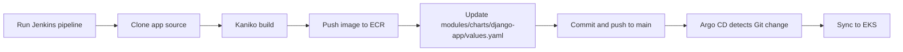

# Jenkins + Argo CD CI/CD Project

## Overview

This repository provisions and operates a full CI/CD + GitOps stack on AWS:

- Terraform provisions infrastructure and platform components.
- Jenkins (Helm) builds and publishes Docker images to ECR.
- Argo CD (Helm) watches Git and deploys Helm chart changes to EKS.
- Current defaults use external Git repositories for app source and GitOps updates.

Current defaults:

- AWS region: `eu-north-1`
- Terraform backend bucket: `terraform-state-devops-homework-5-1`
- Terraform backend key: `lesson-10/terraform.tfstate`
- Terraform lock table: `terraform-locks`
- EKS cluster: `lesson-7-eks`
- ECR repository: `lesson-5-ecr`
- RDS instance identifier: `lesson-10-db`
- Jenkins namespace: `jenkins`
- Argo CD namespace: `argocd`
- App repository: `https://github.com/kgrebets/devops-django-test-app.git`
- GitOps repository: `https://github.com/kgrebets/devops-lesson-9.git`
- GitOps chart path: `modules/charts/django-app`

## Current Repository Layout

```text
.
├── main.tf
├── backend.tf
├── outputs.tf
├── Jenkinsfile
├── modules/
│   ├── s3-backend/
│   ├── vpc/
│   ├── ecr/
│   ├── eks/
│   ├── rds/
│   ├── jenkins/
│   ├── argo_cd/
│   └── charts/
│       └── django-app/
└── README.md
```

## What Terraform Deploys

1. S3 + DynamoDB for Terraform state and locking (`module "s3_backend"`).
2. VPC with public/private subnets, routes, IGW, NAT.
3. ECR repository for application images.
4. EKS cluster + managed node group + EBS CSI addon.
5. RDS module (`modules/rds`, see its [README](modules/rds/README.md)):
   - standard `aws_db_instance` (PostgreSQL/MySQL) or Aurora Cluster, switchable via
     the `use_aurora` flag,
   - DB Subnet Group + Security Group + Parameter Group created automatically for
     both modes.
6. Jenkins via Helm, including:
   - persistent volume via EBS CSI storage class,
   - IRSA role for agent pod ECR push,
   - JCasC credentials and seed job.
7. Argo CD via Helm + local app chart with:
   - Application definition,
   - repository config,
   - automated sync (`prune` + `selfHeal`).

## Jenkins Pipeline (Current)

`Jenkinsfile` stages:

1. Checkout application source from `APP_REPOSITORY`.
2. Build and push image with Kaniko to `${ECR_REPOSITORY}:${IMAGE_TAG}`.
3. Clone `GITOPS_REPOSITORY`.
4. Update image `repository` and `tag` in `GITOPS_VALUES_FILE`.
5. Commit and push to `main`.

Important current behavior:

- Build context and Dockerfile use `${WORKSPACE}/app-src`.
- GitOps working copy uses `${WORKSPACE}/gitops`.
- Image tag format: `${BUILD_NUMBER}-${short_commit_or_manual}`.
- Values updates are made with `sed` in `modules/charts/django-app/values.yaml` of the GitOps repository.

## GitOps Flow



## Deploy / Update

```bash
terraform init
terraform plan
terraform apply
```

If this is the first run in a new AWS account, create/import backend resources before using remote backend in `backend.tf`.

## Post-Deploy Verification

### 1) EKS

```bash
aws eks update-kubeconfig --region eu-north-1 --name lesson-7-eks
kubectl get nodes
```

### 2) Jenkins

```bash
kubectl get pods -n jenkins
kubectl get svc -n jenkins
kubectl get sa -n jenkins
```

Get Jenkins admin password:

```bash
kubectl exec -n jenkins -it svc/jenkins -c jenkins -- /bin/cat /run/secrets/additional/chart-admin-password
```

### 3) Argo CD

```bash
kubectl get pods -n argocd
kubectl get svc -n argocd
kubectl get applications -n argocd
```

Get Argo CD admin password (PowerShell):

```powershell
$b64 = kubectl -n argocd get secret argocd-initial-admin-secret -o jsonpath='{.data.password}'
[System.Text.Encoding]::UTF8.GetString([System.Convert]::FromBase64String($b64))
```

Alternative command used by module output:

```bash
kubectl -n argocd get secret argocd-initial-admin-secret -o jsonpath={.data.password} | base64 -d
```

## Jenkins Jobs

After Jenkins is up:

1. Run `seed-job` to generate the pipeline job.
2. Run `goit-django-docker` to execute CI and GitOps update.